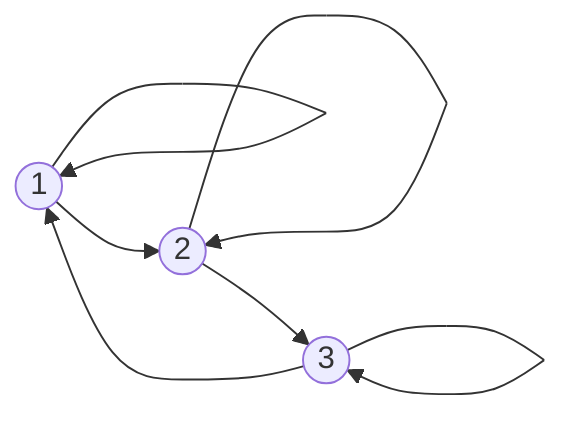

## Matrici riducibili
Una matrice $A\in\mathbb{R}^{n\times n}, n>2$ si dice riducibile se $\exists$ una matrice di permutazione $P$ ed un intero $k,\ 0<k<n$ tale che:
$$
\begin{gathered}
B = PAP^T = \left(\begin{array}{cc}
A_{11} & A_{12} \\
O & A_{22}
\end{array}\right)
\begin{array}{l}
\} \ k \text{ righe} \\
\} \ n-k \text{ righe}
\end{array}\\
\qquad 
\begin{array}{cc}
\underbrace{\hspace{.5cm}}_{k \text{ col}} & \underbrace{\hspace{.5cm}}_{n-k \text{ col}}
\end{array}
\end{gathered}
$$
in caso contrario è detta irriducibile
Per stabilire se una matrice è riducibile o no, si può studiare il grafo orientato associato ad essa. È un grafo orientato con $n$ nodi ed un arco orientato dall'$i$-esimo al $j$-esimo nodo per ogni elemento $a_{ij}\ne0$.
$$
A=\begin{pmatrix}
1&3&0\\ 0&2&-1\\ -1&0&2
\end{pmatrix}
$$

- Archi contigui -> il nodo di arrivo del primo è quello di partenza del secondo
- Cammino orientato -> successione di archi contigui
- Cammino chiuso -> cammino orientato in cui partenza e arrivo coincidono
- Grafo fortemente connesso -> se $\forall(i,j),i\ne j,\ \exists$ un cammino orientato dal nodo $i$ al nodo $j$ 

#### Th.
Una matrice $A$ è riducibile $\iff$ il suo grafo associato NON è fortemente connesso

## Metodi iterativi
Partendo sempre dal sistema $Ax=b, A\in\mathbb{R}^{n\times n},x,b\in\mathbb{R}^n,|A|\ne0$. Formalmente i metodi iterativi producono una successione di vettori soluzione approssimata
$$
\{x^{(k)}\}_{k\in\mathbb{N}}\longrightarrow x^*
$$
### Tecnica generale
Si decompone la matrice $A$ nella forma
$$A=M-N$$
Con $M$ singolare e avente elementi diagonali non nulli - (condizione di applicabilità del metodo iterativo)

Il sistema diventa:
$$\begin{gathered}
Ax=b\\ (M-N)x=b\\ Mx=Nx+b\\ M^{-1}Mx=M^{-1}Nx+M^{-1}b\\ x=(M^{-1}N)x+M^{-1}b
\end{gathered}$$
Fissato un vettore iniziale, o di innesco, la successione è così definita:
$$
x^{(k)}=(M^{-1}N)x^{(k-1)}+M^{-1}b\qquad k=1,2,\dots
$$
$M^{-1}N$ è detta MATRICE DI ITERAZIONE del metodo
### Convergenza
Un M.I. è detto convergente se, quale che sia il vettore di innesco $x^{(0)}$, la successione $\{x^{(k)}\}_{k\in\mathbb{N}}$ è convergente, ovvero:
$$
\exists\ \text{ una norma per cui }\lim\limits_{k\to+\infty}\|e^{(k)}\|=0,\quad \text{ con }e^{(k)}:=x^*-x^{(k)}
$$
##### C.N.S. per la convergenza (di qualsiasi metodo)
$$
\rho(M^{-1}N)<1
$$
##### C.S.
Se $\exists$ una norma indotta per cui $\|M^{-1}N\|<1\Rightarrow$ il metodo è convergente
Dim. segue dal th. di Hirsch

### Metodi di Jacobi e Gauss-Seidel
Consideriamo la decomposizione
$$
A=D-B-C\qquad\text{ con }\qquad D=\begin{cases}
a_{ij},&i=j\\ 0,& i\ne j
\end{cases}\qquad
B=\begin{cases}
0,&i\le j\\ -a_{ij},& i> j
\end{cases}\qquad
C=\begin{cases}
-a_{ij},&i<j\\ 0,& i\ge j
\end{cases}
$$
$$
A=\begin{pmatrix}
a_{11} & a_{12} & a_{13}\\
a_{21} & a_{22} & a_{23}\\
a_{31} & a_{32} & a_{33}\\
\end{pmatrix}\qquad
D=\begin{pmatrix}
a_{11} & 0 & 0\\
0 & a_{22} & 0\\
0 & 0 & a_{33}\\
\end{pmatrix}\qquad
B=\begin{pmatrix}
0 & 0 & 0\\
-a_{21} & 0 & 0\\
-a_{31} & -a_{32} & 0\\
\end{pmatrix}\qquad
C=\begin{pmatrix}
0 & -a_{12} & -a_{13}\\
0 & 0 & -a_{23}\\
0 & 0 & 0\\
\end{pmatrix}
$$
 Partendo da queste otteniamo il metodo di Jacobi scegliendo:
 $$
 M=D\qquad\qquad\qquad N=B+C
 $$
 $$
 M=D=\begin{pmatrix}
a_{11} & 0 & 0\\
0 & a_{22} & 0\\
0 & 0 & a_{33}\\
\end{pmatrix}\qquad
N=B+C=B=\begin{pmatrix}
0 & -a_{12} & -a_{13}\\
-a_{21} & 0 & -a_{23}\\
-a_{31} & -a_{32} & 0\\
\end{pmatrix}
 $$
 mentre si ottiene Gauss-Seidel scegliendo:
 $$
 M=D-B\qquad\qquad\qquad N=C
 $$
 $$
 M=D-B=\begin{pmatrix}
a_{11} & 0 & 0\\
a_{21} & a_{22} & 0\\
a_{31} & a_{32} & a_{33}\\
\end{pmatrix}\qquad\qquad
 N=C=\begin{pmatrix}
0 & -a_{12} & -a_{13}\\
0 & 0 & -a_{23}\\
0 & 0 & 0\\
\end{pmatrix}
 $$
 La matrice di iterazione di Jacobi e il vettore dei termini noti sono:
 $$
 B_J=M^{-1}N=D^{-1}(B+C)=\begin{pmatrix}
 0&-\frac{a_{12}}{a_{11}}&\cdots&-\frac{a_{1n}}{a_{11}}\\
 -\frac{a_{12}}{a_{22}}&0&\cdots&-\frac{a_{2n}}{a_{22}}\\
 \vdots&\vdots&&\vdots\\
 -\frac{a_{n1}}{a_{nn}}&-\frac{a_{n2}}{a_{nn}}&\cdots&0
 \end{pmatrix}\qquad
 d=M^{-1}b=D^{-1}b=
 \begin{pmatrix}
 \frac{b_1}{a_{11}}\\
 \frac{b_2}{a_{22}}\\
 \vdots\\ \frac{b_n}{a_{nn}}
 \end{pmatrix}
 $$
 L'iterazione diventa:
 $$
 x^{(k)}=[D^{-1}(B+C)]x^{(k-1)}+D^{-1}b
 $$
 In termini di componenti:
 $$
 x_i^{(k)}=\frac1{a_{ii}}\bigg[b_i-\sum\limits_{j=1,j\ne i}^na_{ij}x_j^{(k-1)}\bigg]
 $$
 Jacobi è detto metodo degli spostamenti simultanei, poiché tutte le componenti $x_i$ del passo $k-1$ vengono usate per valutare tutte le componenti $x_i$ del passo $k$.
 L'iterazione del metodo di Gauss-Seidel invece è:
 $$
 x^{(k)}=[(D-B)^{-1}C]x^{(k-1)}+(D-B)^{-1}b
 $$
 anche questa funziona con gli spostamenti simultanei. Ma poiché calcolare $(D-B)^{-1}$ può essere molto costoso, la trasformiamo in una forma equivalente
 $$\begin{gathered}
 (D-B)x^{(k)}=Cx^{(k-1)}+b\\
 Dx^{(k)}-Bx^{(k)}=Cx^{(k-1)}+b\\
 Dx^{(k)}=Bx^{(k)}+Cx^{(k-1)}+b\\
 x^{(k)}=D^{-1}Bx^{(k)}+D^{-1}Cx^{(k-1)}+D^{-1}b
 \end{gathered}$$
 e siamo passati al metodo degli spostamenti successivi, in cui ritroviamo $x_i^{(k)}$ sia a destra che a sinistra. Al passo $k$-esimo, per calcolare la componente $x_i^{(k)}$ si usano le componenti dello stesso passo già calcolate $x_j^{(k)},j=1,\dots,i-1$ e le componenti del passo precedente $x_j^{(k-1)},j=i+1,\dots,n$ .
 In termini generali:
 $$
 x_i^{(k)}=\frac1{a_{ii}}\bigg[ b_i-\sum\limits_{j=1}^{i-1}a_{ij}x_j^{(k)}-\sum\limits_{j=i+1}^{n}a_{ij}x_j^{(k-1)} \bigg]
 $$
### Condizioni di convergenza (per Jacobi/Gauss-Seidel)
C.S. Se la matrice $A$ verifica una delle seguenti:
- $A$ a predominanza diagonale forte per righe/colonne
- $A$ a predominanza diagonale debole per righe/colonne ed è irriducibile
allora $\rho(B_J)<1$ e $\rho(B_{GS})<1$ e quindi convergono

#### Caso matrici tridiagonali
Se $A$ è tridiagonale di ordine $n,\ a_{ii}\ne0,$ allora i metodi di Jacobi e Gauss-Seidel sono entrambi convergenti o entrambi divergenti.
Se convergono, G-S converge più velocemente e si ha $\rho(B_{GS})=\rho^2(B_J))$ 

### Velocità di convergenza di un MI
Il raggio spettrale della matrice di iterazione, oltre a dare info sulla convergenza o divergenza, viene assunto anche come misura della velocità di convergenza del metodo. Si dimostra che il numero $k$ di iterazioni necessarie per ridurre di $\frac1{10}$ l'errore $e^{(k)}$, è tale che:
$$
[\rho(M^{-1}N)]^k\approx \frac1{10},\quad \text{ da cui } k=-\frac{1}{\log_{10}[\rho(M^{-1}N)]}
$$
DEF. Si definisce velocità/tasso asintotico di convergenza di un MI la quantità:
$$
R=-\log_{10}[\rho(M^{-1}N)]
$$

> [!NOTE] NB
> $\rho(M^{-1}N)<1$ ma molto vicino a $1$, può esserci convergenza teorica, ma non pratica. Ciò può accadere anche se $A$ è malcondizionata
#### Criterio di arresto
1. Primo criterio
	Sappiamo che l'errore relativo è $\frac{\|x^*-x^{(k)}\|}{\|x^*\|}$ . Prendiamo l'errore relativo tra vettori di passi successivi $\frac{\|x^{(k-1)}-x^{(k)}\|}{\|x^{(k)}\|}\longrightarrow0$ e fissiamo un certo valore di tolleranza che vogliamo raggiungere
	$$\frac{\|x^{(k-1)}-x^{(k)}\|}{\|x^{(k)}\|}\le\text{toll}$$
2. Secondo criterio
	Fisso un numero massimo di passi $k$. In genere voglio che sia:
	$$kn^2\le\frac{n^3}{3}$$ 