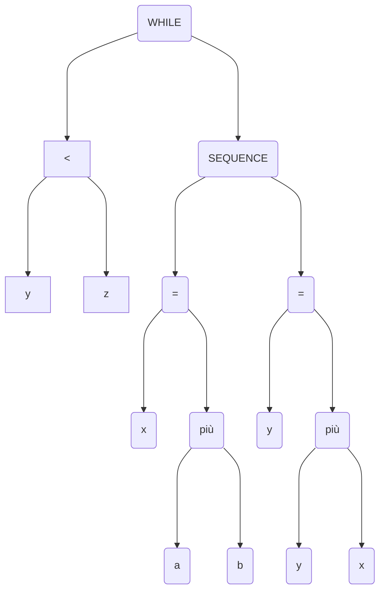

Fasi da attraversare prima che un programma possa essere reso eseguibile 

- **Preprocessing** - creazione del file da compilare
- **Compilazione** - traduzione dal sorgente all'assembly
- **Assembling** - trasforma l'assembly in codice macchina rilocabile (non abbiamo ancora riferimenti assoluti alla memoria)
- **Linking/Loading** - Si risolvono o assegnano gli indirizzi di memoria esterna (linker), e tutti i file vengono caricati in memoria (loader)

### Linguaggi simbolici

Ogni compilatore utilizza linguaggi simbolici definiti da:

- **Alfabeto** - insieme dei simboli usati
- **Lessico** - insieme delle parole che formano il linguaggio
- **Sintassi** - insieme delle regole per la formazione delle frasi
- **Semantica** - significato da associare ad ogni parola ed istruzione

#### Fasi della compilazione
Si possono dividere in due parti : **Analisi** e **Sintesi**

--- start-multi-column: ID_xalz
```column-settings
Number of Columns: 2
Largest Column: standard
```

$$\begin{gathered}
\text{ANALISI}\\ \text{Dipende dal linguaggio}\\ \text{verifica la presenza di errori}\\
\text{detto FRONT-END}\\ \\
\text{- Analisi lessicale}\\ \text{- Analisi sintattica}\\ \text{- Analisi semantica}\\
\text{- Generazione codice intermedio}
\end{gathered}$$

--- column-break ---

$$\begin{gathered}
\text{SINTESI}\\ \text{Ottimizzazione del codice intermedio}\\ \text{e creazione del codice target}\\
\text{detto BACK-END}\\ \\
\text{- Ottimizzazione}\\ \text{- Generazione codice target e}\\ \text{- Codice oggetto}\\
\end{gathered}$$

--- end-multi-column

### Analisi lessicale
Si effettua uno scanning del codice e lo si suddivide in **lessemi**. Ad ogni lessema viene associato un token con un attributo (se necessario). Per i token con lo stesso nome viene creata una symbol table

--- start-multi-column: ID_kz1z
```column-settings
Number of Columns: 3
Largest Column: standard
```

```c
while(y<z){
	int x = a + b;
	y += x:  
}
```

--- column-break ---


| nome_token   | attributo |
| ------------ | --------- |
| T_While      |           |
| T_LeftParen  |           |
| T_Identifier |           |
| T_Less       |           |
| T_Identifier | $y$       |
| T_RightParen |           |
| T_OpenBrace  | $x$       |
| $\vdots$     |           |


--- column-break ---


Symbol Table

| All. Memoria | Simbolo | Proprietà |
| ------------ | ------- | --------- |
| 1            | y       | int       |
| 2            | z       | int       |
| 3            | x       | int       |
| 4            | a       | const     |
| 5            | b       | const     |


--- end-multi-column
### Analisi Sintattica
Detta anche parsing. I token vengono usati per definire la struttura grammaticale del codice, e verificare che rispettino la sintassi del linguaggio. Il parser usa la lista dei token e la symbol table per generare per ogni istruzione il corrispondente albero sintattico


### Analisi semantica 
Si usano l'albero sintattico e la symbol table per controllare la correttezza semantica, cioè:
- dichiarazione variabili
- utilizzo corretto di operatori
- type checking
Produce come output un albero sintattico decorato
#### Semantica statica
Il compilatore si occupa di correggere gli errori di semantica statica, cioè quegli errori evidenti in fase di lettura del codice (es. usare un float come indice di un array)
#### Semantica dinamica
Dipende dall'esecuzione del programma. È gestita da un interprete o un supporto esecutivo

### Generazione del codice intermedio
Dall'albero semantico decorato si passa a generare un codice intermedio. Uno dei più usati è il **three-address-code**, 3AC, formato da istruzioni con al più tre operandi:
$$
\text{id}:=\text{id1 operator id2}
$$
- ogni istruzione ha al più un operatore sul lato destro
- l'ordine di lettura fissa l'ordine di esecuzione
- vengono generati nomi temporanei per valori intermedi
- ci possono essere istruzioni con meno di tre operandi


--- start-multi-column: ID_pk9z
```column-settings
Number of Columns: 2
Largest Column: standard
```

```c
while(y<z){
	int x = a + b;
	y += x;
}
```

--- column-break ---

```
	_t1 := y >= z
	IF _t1 goto L2
L1: x := a + b
	y := x + y
	_t1 := y < z
	IF _t1 goto L1
L2: ...
```

--- end-multi-column
### Ottimizzazione del codice
Si cerca di trasformare il codice intermedio per renderlo più efficiente, sempre indipendentemente dalla macchina. Questa è un'operazione molto lente, per questo alcuni compilatori permettono di disattivarla o non l'hanno proprio. Ci sono alcune regole di ottimizzazione da seguire, ma questo è un problema indecidibile.
- Calcolare una sola volta operazioni con lo stesso esito
- eliminare moltiplicazioni/divisioni per 1 e addizioni/sottrazioni per 0
- portare fuori istruzioni indipendenti dai cicli

### Generazione codice target
Si effettua una traduzione del codice intermedio ottimizzato in codice macchina o assembly. Se il codice target è il linguaggio macchina, allora vengono anche assegnati registri e locazioni di memoria alle variabili tramite linker e loader. A seconda dei casi è anche possibile ottimizzare ulteriormente il codice oggetto.

## Gestione degli errori
Durante una qualsiasi fase della compilazione si possono riscontrare degli errori. Possono essere tali da bloccare il processo o meno, o che un errore ne provochi un altro.
Il problema di trovare tutti gli errori è indecidibile.

#### Fasi e passaggi
L'esecuzione delle fasi descritte fin ora non sono sempre sequenziali
- One-pass compiler: ogni fase della compilazione viene eseguita sequenzialmente una sola volta
- Multi-step compiler: le fasi della compilazione si possono alternare e/o ripetere più volte.

Un compilatore a una passata è in genere più veloce, ma alcuni linguaggi sono dipendenti dalla possibilità di compilare in passaggi multipli. Ad esempio per linguaggi che prevedono la mutua ricorsione o in cui le variabili possono essere dichiarate in qualsiasi parte del programma. In ogni caso una compilazione a singola passata non è in grado di generare codice di alta qualità.

---
**Bootstrapping** - scrivere un compilatore usando una versione minimale del linguaggio che deve compilare
**Cross Compiler** - il compilatore gira su una macchina diversa da quella su cui girerà il codice target