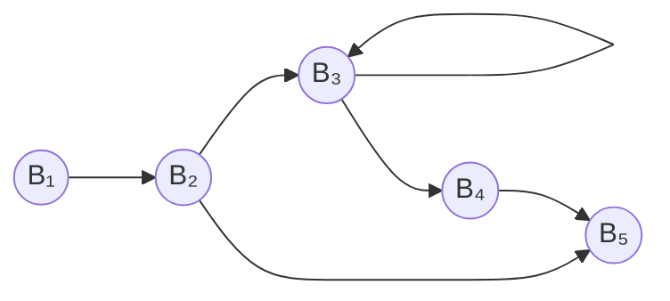

3AC -> 3 Address Code
Utilizza al più 3 indirizzi per ogni istruzione e ammette al più un operatore
$$
\text{ID} = \text{ID1}\ \text{operator}\ \text{ID2}
$$
Gli indirizzi possono essere: 
- nomi
- costanti
- indirizzi temporanei
Le istruzioni possono essere :
- assegnazione
- copia
- salti incondizionati
- salti condizionati
- Halt
- return

Es: 
$$
\begin{array}{l}
\text{while(x<10)}\\
\qquad x=x+1
\end{array}\qquad\Rightarrow\qquad
\begin{array}{ll}  
L: & t_1 := x<10\\  
& \text{iffalse }t_1 \text{ goto } L_1 \\  
& t_2 = x+1\\  
& x = t_2\\
& \text{goto }L\\
L_1: & ... \\  
\end{array}
$$
Funzioni:
$$
\begin{array}{l}
n= f(a_1, a_2)
\end{array}\qquad\Rightarrow\qquad
\begin{array}{ll}  
& \text{param }a_1\\  
& \text{param }a_2 \\  
& t_1 = \text{call }f, 2\\  
& n = t_1\\
\end{array}
$$
Copie indicizzate:
$$
x=y[i]\qquad x[i] = y
$$
Assegnazione di indirizzi e puntatori:
$$
x=\&y\qquad x=*y\qquad *x = y
$$
Altri esempi:
$$
\begin{array}{l}
\text{if(x<10 \&\& y || z>0)}\\
\qquad \text{do}()
\end{array}\qquad\Rightarrow\qquad
\begin{array}{ll}  
& t_1 := x<10\\  
& t_2 = t_1\ \&\&\ y \\  
& \text{if }t_2 \text{ goto }L\\  
& t_3 = z>0\\
& \text{iffalse }t_3\text{ goto } L_1\\
L: & \text{call }do, 0 \\
L_1: & ...  
\end{array}
$$
$$
\begin{array}{l}
\text{if(x)}\\
\quad \text{do1}()\\
\text{else}\\
\quad \text{do2}()
\end{array}\qquad\Rightarrow\qquad
\begin{array}{ll}  
& \text{iffalse } x \text{ goto }L_2\\  
& \text{call }do1, 0\\  
& \text{ goto }L_3\\  
L_2: & \text{call }do2, 0 \\
L_3: & ...  
\end{array}
$$

## Ottimizzazione del codice intermedio

Si cercano di effettuare ottimizzazioni indipendenti dalla macchina. È un problema indecidibile, ma esistono dei pattern riconoscibili per effettuare qualche ottimizzazione.
- Copy propagation  e  Ripiegamento costanti
	$$
	\begin{array}{l}
	i=0\\ j=i+1
	\end{array}\quad\Rightarrow\quad
	\begin{array}{l}
	i=0\\ t_1=i+1\\ j= t_1
	\end{array}\quad\Rightarrow\quad
	\begin{array}{l}
	i=0\\ j=i+1
	\end{array}\quad\Rightarrow\quad
	\begin{array}{l}
	i=0\\ j=1
	\end{array}
	$$
- Riduzione dei salti
	$$
	\begin{array}{l}
	\text{while}(a)\\ \quad\text{while}(b)\\\qquad \text{do}1()\\\quad \text{do2}() 
	\end{array}\quad\Rightarrow\quad
	\begin{array}{l}
	\begin{array}{ll}  
	A: & \text{iffalse }a\text{ goto } X\\  
	B: & \text{iffalse }b\text{ goto } Y \\  
	& \text{call }do1, 0\\  
	& \text{goto }B\\
	Y& \text{call }do2, 0\\
	& \text{goto }A\\
	X: & ...  
	\end{array}
	\end{array}\quad\Rightarrow\quad
	\begin{array}{l}
	\begin{array}{ll}  
	& \text{iffalse }a\text{ goto } X\\  
	A': & \text{iffalse }b\text{ goto } Y \\  
	B':& \text{call }do1, 0\\  
	& \text{if }b\text{ goto }B'\\
	Y& \text{call }do2, 0\\
	& \text{if }a\text{ goto }A'\\
	X: & ...  
	\end{array}
	\end{array}
	$$
- Eliminazione codice morto
- Eliminazione sotto-espressioni comuni
	$$
	\begin{array}{l}
	s=\max(a,b)\\ t+=\max(a, b)
	\end{array}\quad\Rightarrow\quad
	\begin{array}{l}
	\begin{array}{ll}  
	& \text{param }a\\
	& \text{param }b\\
	&t_1 = \text{call }\max, 2\\
	&s = t_1 \\
	& \text{param }a\\
	& \text{param }b\\
	&t_2 = \text{call }\max, 2\\
	&t =t+ t_2 \\
	\end{array}
	\end{array}\quad\Rightarrow\quad
	\begin{array}{l}
	\begin{array}{ll}  
	& \text{param }a\\
	& \text{param }b\\
	&s = \text{call }\max, 2\\
	&t = t+s \\
	\end{array}
	\end{array}
	
	$$
- Eliminazione operazioni ridondanti/inutili (somma con 0, molt. per 1, ...)
- Estrazione del codice invariante in un ciclo
- Espansione in linea delle funzioni o eliminazione ricorsioni in coda
	$$
	\begin{array}{l}
	\text{int fact}(n)\{\\
	\quad\text{if }(n==0)\{\\
	\qquad\text{return }1\\
	\quad\}\\
	\quad \text{return }n+\text{fact}(n-1)\\
	\}\\\vdots\\\text{read}(i)\\\text{fact}(i)
	\end{array}\quad\Rightarrow\quad
	\begin{array}{l}
	\begin{array}{ll}  
	& \text{iffalse }n\text{ goto } L\\  
	& \text{return }1\\  
	L:& t_1 = n-1\\  
	& \text{param }t_1\\
	& t_2= \text{call fact}, 1\\
	& t_3 = t_2*n\\
	& \text{return }t_3\\
	& \vdots  \\
	& \text{read }i\\
	&\text{param }i\\
	&\text{call fact}, 1
	\end{array}
	\end{array}\quad\Rightarrow\quad
	\begin{array}{l}
	\begin{array}{ll}  
	&\text{read }i\\
	&\text{res}=1\\
	&\text{iffalse }i\text{ goto }L\\
	X:&\text{res}=\text{res}*i\\
	&i=i-1\\
	&\text{if }i\text{ goto }X\\
	L:&\cdots  
	\end{array}
	\end{array}
	
	$$
### Generazione codice target
- allocare e assegnare i registri
- selezione istruzioni
- ordine di valutazione

Si suddividono le righe di codice in **leader** e **non leader**.

$$
\begin{array}{lll}
B_1 && x = 0 \quad \leftarrow \\
    & \text{R: }& \textit{read} \quad \leftarrow \\[6pt]
B_2 && \textit{res} = 1 \\
    && \textbf{iffalse } i \textbf{ goto } L \\[6pt]
B_3 & \text{X: }& \textit{res} = \textit{res} \times 1 \quad \leftarrow \\
    && i = i - 1 \\
    && \textbf{if } i \textbf{ goto } X \\[6pt]
B_4 && x = 1 \quad \leftarrow \\[6pt]
B_5 && \ldots \quad \leftarrow \\
\end{array}
$$

I generatori di codice, per agevolare l'ottimizzazione del codice, suddividono il codice in blocchi, che diventano nodi in un grafo. Si suddividono le righe in Leader e non.
Una riga è leader se:
- è la prima del codice
- è la destinazione di un salto
- è la prima dopo un goto

aaa
pro
provaaaaaaaaaaavaprova