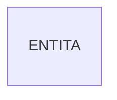
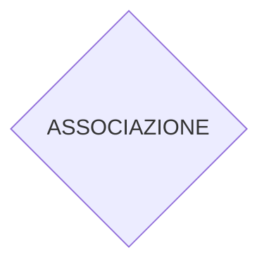
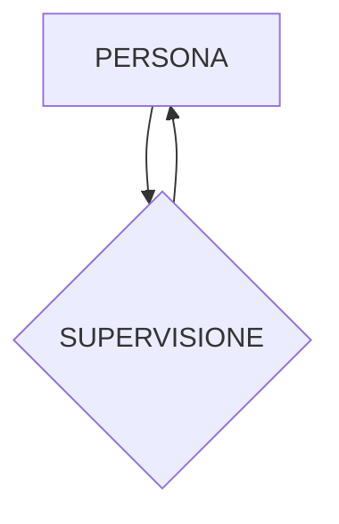
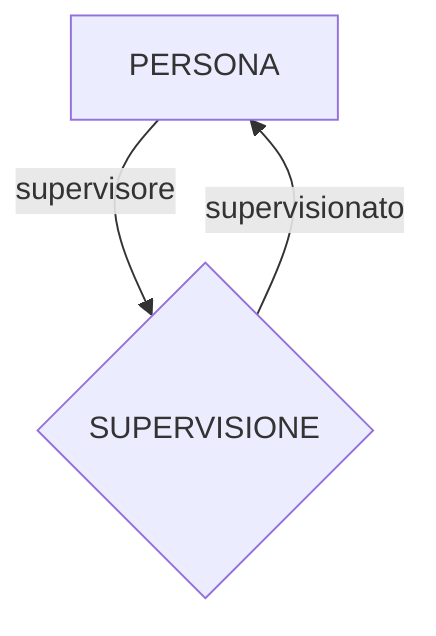
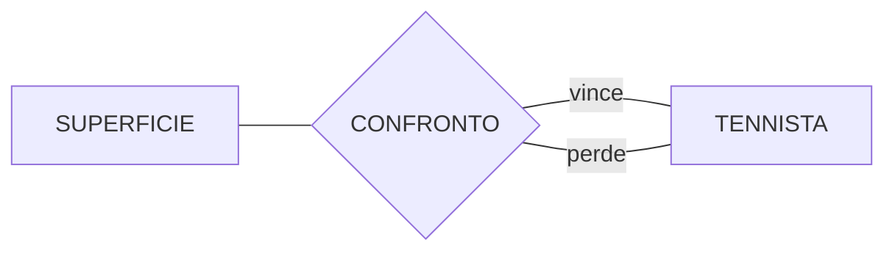
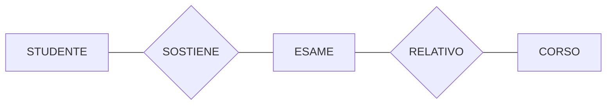

### Ciclo di vita

Studio di fattibilità → Raccolta e analisi dei requisiti → Progettazione → Realizzazione → Validazione e collaudo → Funzionamento

Noi ci occupiamo della raccolta dei requisiti e della progettazione dei dati

### Metodologie di progetto

- Decomposizione: divisione in fasi
- Strategie: criteri di scelta
- Rappresentazione: scelta del modello
- Generalità
- Qualità
- Facilità d’uso

### Modelli Logici

Utilizzati dai DBMS per l’organizzazione dei dati. Indipendenti dalle strutture fisiche

### Modelli Concettuali

Rappresentazione dei dati indipendente dal sistema. Cercano di descrivere concetti reali del mondo. Sono utili per avere una rappresentazione grafica

## Modello Entity-Relationship (modello concettuale)

Costrutti del modello E-R:

- Entità
- Cardinalità
- Associazione
- Attributo
- Identificatore
- Generalizzazione

### Entità

Classe di oggetti con proprietà comuni ed esistenza autonoma

Un elemento di un’entità è detto OCCORRENZA

### Associazione

Legame logico fra  2 o più entità

Un’occorrenza di un’associazione è una coppia, o n-pla di occorrenze di entità, una per ogni entità coinvolta

Due associazioni possono legare le stesse due entità

### Entità ricorsiva

### Entità ricorsiva con ruoli

### Associazione ternaria ricorsiva

### Attributo

Proprietà elementare di un’entità o associazione

### Attributo composto

### Cardinalità

Coppia di valori interi associati a ogni entità che partecipa all’associazione. Specificano il numero di occorrenze dell’associazione a cui ogni istanza di entità può partecipare

- Ad ogni impiegato possono essere assegnati da 1 a 5 incarichi
- Ad ogni incarico possono essere assegnati da 0 a 50 impiegati

Per semplicità usiamo solo tre simboli:

Cardinalità minima:

- 0 → partecipazione opzionale
- 1 → partecipazione opzionale

Cardinalità massima:

- 1 → unicità
- N → nessun limite

Riguardo alle cardinalità massime, abbiamo tre tipi di associazioni:

- Uno a Uno
- Uno a Molti
- Monti a Molti

Cardinalità degli attributi:

Minima:

- 0 → opzionale
- 1 → obbligatorio

Massima:

- 1 → unico
- N → attributo multivalore

### Identificatori interni

### Identificatori esterni

La matricola è unica per ogni università, ma possono esserci studenti di diverse università con la stessa matricola.

È possibile solo se l’entità da identificare partecipa con cardinalità $(1, 1)$

### Generalizzazione

Può capitare che più entità risultino simili, oppure una è un caso particolare dell’altra. Si creano quindi delle gerarchie di specializzazione.

- $E$ è generalizzazione di $E_1,\cdots E_n$
- $E_1,\cdots,E_n$ sono specializzazioni (sottotipi) di $E$

- Ereditarietà: ogni proprietà di $E$ lo è anche di $E_n$
- Inclusione: ogni occorrenza di $E_n$ lo è anche di $E$

Una generalizzazione è TOTALE se ogni occorrenza di $E$ è occorrenza di almeno una entità $E_n$, altrimenti è PARZIALE

Una generalizzazione è ESCLUSIVA se ogni occorrenza di $E$ è occorrenza di al più una entità $E_n$, altrimenti è SOVRAPPOSTA

## Documentazione

Ci sono alcune regole che non sono esprimibili con il modello E-R. Per questo è necessaria una documentazione, che contiene dizionario dei dati e asserzioni (regole) che il DB deve avere.

### Dizionario dei Dati - Entità

| Entità | Descrizione | Attributi | Identificatore |
| --- | --- | --- | --- |
| Impiegato | dipendente dell’azienda | $\cdots$ | $\cdots$ |
| Progetto | progetti aziendali | $\cdots$	 | $\cdots$ |
| Dipartimento | struttura aziendale | $\cdots$ | $\cdots$ |
| Sede | sede dell’azienda | $\cdots$ | $\cdots$ |

### Dizionario dei Dati - Associazioni

| Relazioni | Descrizione | Componenti | Attributi |
| --- | --- | --- | --- |
| Direzione | direzione di un dipartimento | Impiegato, Dipartimento | $\cdots$ |
| Afferenza | $\cdots$ | $\cdots$	 | Data |
| Partecipazione | $\cdots$ | $\cdots$ | $\cdots$ |
| Composizione | $\cdots$ | $\cdots$ | $\cdots$ |

### Asserzioni

Sono vincoli di integrità non esprimibili mediante lo schema 

Le asserzioni hanno la forma:

$$
\text{<CONCETTO> deve/non deve <espressione su concetto>}
$$

### Derivazioni

Sono concetti che possono essere ottenuti tramite inferenza o calcolo aritmetico, da altri concetti dello schema. Nella forma:

$$
\text{<CONCETTO> si ottiene mediante <operazioni su concetti>}
$$

# Progettazione concettuale

Comprende:

- Acquisizione dei requisiti
- Analisi dei requisiti
- Costruzione dello schema concettuale
- Costruzione del glossario

## Raccolta ed analisi dei requisiti

Con raccolta si intende l’individuazione dei problemi e le caratteristiche del sistema, sia dei dati che delle operazioni sui dati.

L’analisi consiste nell’organizzazione dei requisiti raccolti

Possibili fonti:

- Utenti (committenti): Interviste, questionari, documentazione apposita
- Documentazione esistente: normative, regolamenti interni
- Realizzazioni preesistenti

## Pattern di progetto

### Reificazione di attributo di entità

A volte un attributo di cui vogliamo avere più informazioni va trasformato in entità e collegato con associazione

### Associazioni “parte di”

Un’associazione può indicare il fatto che un’entità è parte di un’altra

### Associazione “istanza di”

Un’associazione che indica che le occorrenze di un’entità sono istanze di occorrenze di un’altra entità

### Reificazione di entità binaria

Un’associazione può dover essere trasformata in una terza entità che collega le due iniziali

Si trasforma in:

### Reificazione di attributo di relazione

Attributo di un’associazione che viene trasformato in entità.

si trasforma in:

### Storicizzazione di un concetto

Usare la generalizzazione per distinguere tra dati passati e dati correnti

## Strategie di progetto

- Top-Down
    
    Schema concettuale prodotto da una serie di raffinamenti successivi a partire da uno schema iniziale che descrive tutte le specifiche con pochi concetti astratti
    
    Raffinamento attraverso:
    
    - Definizione degli attributi di una entità/relazione
    - Reificazione di un attributo o relazione
    - Decomposizione di una relazione in due relazioni distinte
    - Trasformazione di un’entità in una gerarchia di generalizzazione
    
    VANTAGGIO → si hanno a disposizione tutte le specifiche
    
- Bottom-Up
    
    Si dividono le specifiche in componenti sempre più piccoli, si realizzano i loro schemi concettuali, e poi vengono fusi in un unico schema concettuale finale.
    
    Trasformazione tramite:
    
    - Inserimento di una nuova entità o relazione dall’analisi delle specifiche
    - Individuare un legame tra le entità riconducibile ad una generalizzazione
    - Aggregare una serie di attributi in un’entità o relazione
    
    VANTAGGIO → è facile dividere il lavoro tra più persone
    
    SVANTAGGIO → Si devono integrare schemi concettuali diversi
    
- Inside-Out
    
    Si parte da alcuni concetti ritenuti importanti e si vanno sviluppando quelli ad essi collegati, andando via via verso quelli più lontani
    
    Procedimento:
    
    - Si individuano i concetti principali e si realizza uno schema scheletro
    - Si decompone lo scheletro
    - Si raffina, espande e integra
    
    SVANTAGGIO → si devono esaminare tutte le specifiche per individuare i concetti non ancora rappresentati
    

### Qualità di uno schema concettuale

- Correttezza: se utilizza propriamente i costrutti del modello di riferimento, dal punto di vista sintattico e semantico
- Completezza: quando rappresenta tutti i dati di interesse e tutte le operazioni possono essere eseguite a partire dai concetti descritti dallo schema
- Leggibilità: rappresenta i requisiti in maniera naturale e facilmente comprensibile
- Minimalità (non ridondanza): le specifiche sui dati sono rappresentate una sola volta nello schema

# Progettazione logica

Traduzione dello schema concettuale in schema logico in maniera corretta ed efficiente. Non è una traduzione semplice però, alcuni concetti dello schema non sono direttamente rappresentabili, e bisogna tenere conto delle prestazioni. Bisogna quindi effettuare una ristrutturazione dello schema.

## Prestazioni

Parametri da considerare:

- Spazio di memoria
- Tempo: numero di occorrenze visitate durante un’operazione

Quindi serve essere a conoscenza di

- Volume dei dati:
    - Numero di occorrenze di ogni entità/associazione
    - dimensioni di ciascun attributo
- Caratteristiche delle operazioni:
    - Frequenza: numero medio di esecuzioni
    - dati coinvolti
    - tipo di operazione: lettura o scrittura

### Tavola dei volumi

| CONCETTO | TIPO | VOLUME |
| --- | --- | --- |
| Sede | E | 10 |
| Dipartimento | E | 80 |
| Impiegato | E | 2000 |
| Composizione | R | 80 |
| Afferenza | R | 1900 |

### Tavola delle operazioni

| Operazione | Frequenza |
| --- | --- |
| Op1 | 50 al giorno |
| Op2 | 2 a settimana |

## Calcolo del costo del tempo di un’operazione

Regola 80-20: l’80% del carico è generato dal 20% delle operazioni

Cosa serve per calcolare il costo:

- schema di navigazione
- carico (tavola dei volumi)
- tavola degli accessi
- frequenza (tavola delle operazioni)
- tipo di operazione (lettura o scrittura)

Schema di navigazione → Parte dello schema ER coinvolto nell’operazione

### Tavola degli accessi

| CONCETTO | COSTRUTTO | ACCESSI | TIPO |
| --- | --- | --- | --- |
| Impiegato | E | 1 | L |
| Afferenza | R | 1 | L |
| Dipartimento | E | 1 | L |
| Partecipazione | R | 3 | L |
| Progetto | E | 3 | L |

tavola degli accessi per l’operazione:

Trova tutti i dati di impiegato, del dipartimento nel quale lavora e dei progetti ai quali partecipa

## Ristrutturazione di uno schema ER

Il costo di un’operazione può essere calcolato su uno schema ristrutturato

Operazioni di ristrutturazione:

- Analisi delle ridondanze
- Eliminazione delle generalizzazioni
- Partizionamento/accorpamento di entità e associazioni
- Eliminazione degli attributi multivalore
- Scelta degli identificatori primari

### Analisi delle ridondanze

Una ridondanza è un’informazione significativa ma derivabile da altre. In questa fase si decide se mantenerle o meno.

Semplificano le operazioni di lettura, ma appesantiscono quelle di scrittura

Le ridondanze possono essere attributi derivabili da altri attributi, o da altre entità, o una ridondanza di associazioni.

### Eliminazione delle generalizzazioni

Le generalizzazioni non sono rappresentabili nel modello relazionale. Vanno sostituite con entità o relazioni. Come:

- Accorpamento delle figlie nel genitore
    
    L’entità genitore assorbe gli attributi delle figlie, che diventano opzionali, e viene aggiunto un nuovo attributo che indica il tipo di entità. Le associazioni sulle figlie vengono spostate sul genitore e avranno cardinalità minima $0$
    
    Conviene se le operazioni non fanno distinzione tra le occorrenze figlie. Per generalizzazioni parziali e totali.
    
- Accorpamento del genitore nelle figlie
    
    L’entità genitore scompare e le figlie ereditano tutti i suoi attributi e relazioni. 
    
    Conviene se si fanno operazioni distinte sulle figlie.
    
    Fattibile solo se la generalizzazione è totale
    
- Sostituzione della generalizzazione con associazioni
    
    Si aggiunge una associazione tra genitore e figlia, obbligatoria da parte della figlia, opzionale da parte del genitore. le figlie avranno un identificatore esterno con il genitore. Inoltre un’occorrenza di $E$ non può partecipare a più associazioni contemporaneamente, e, se la generalizzazione è totale, deve partecipare ad almeno ad una.
    
    Conviene se la generalizzazione è parziale, ma ci sono comunque operazioni che fanno distinzione tra le figlie
    

### Partizionamento/Accorpamento di concetti

Operazione effettuata per ridurre il numero di accessi. Da valutare se si riducono separando attributi di un concetto, o raggruppando attributi di concetti diversi.

### Partizionamento verticale di entità

Un’entità viene divisa in due separate e gli attributi suddivisi tra loro. Le due nuove vengono collegate da un’associazione 1 a 1

### Partizionamento orizzontale di entità

Separazione a seconda del valore assunto da un attributo. Una entità viene duplicata, assieme ai suoi attributi e relazioni

### Accorpamento di entità

Se due entità sono legate da un’associazione 1 a 1, e se le operazioni più frequenti di una richiedono anche i dati dell’altra, allora conviene accorparle

### Partizionamento/Accorpamento delle associazioni

È possibile fare lo stesso ragionamento delle entità anche sulle associazioni, e quindi è possibile duplicarle o accorparle

### Eliminazione degli attributi multivalore

Il modello relazionale non permette la rappresentazione di attributi multivalore.

In questo caso l’attributo multivalore si trasforma in una entità a parte collegata all’entità origine da un’associazione 1 a n

### Scelta degli identificatori primari

Criteri di scelta:

- Assenza di opzionalità
- Semplicità (pochi attributi)
- Utilizzo delle operazioni più frequenti

## Traduzione da concettuale a relazionale

### Associazione Molti a Molti

diventa:

$$
\begin{gathered}
\text{Impiegato}(\underline{\text{Matricola}}, \text{Cognome}, \text{Stipendio})\\
\text{Progetto}(\underline{\text{Codice}}, \text{Nome}, \text{Budget})\\
\text{Partecipazione}(\underline{\text{Matricola}}, \underline{\text{Codice}}, \text{DataInizio})\\
\end{gathered}
$$
### Associazione Molti a Molti ricorsiva

diventa:

$$
\begin{gathered}
\text{Prodotto}(\underline{\text{Codice}}, \text{Nome}, \text{Costo})\\
\text{Composizione}(\underline{\text{Composto}^*}, \underline{\text{Componente}^*}, \text{Quantita})\\
\end{gathered}$$

### Associazione Uno a Molti

diventa:

$$
\begin{gathered}
\text{Giocatore}(\underline{\text{Cognome}}, \underline{\text{DataNascita}}, \text{Ruolo}, \text{Squadra}^*, \text{Ingaggio})\\
\text{Squadra}(\underline{\text{Nome}}, \text{Città}, \text{ColoriSociali})\\
\end{gathered}
$$

### Entità con ID esterno

diventa:

$$
\begin{gathered}
\text{Studente}(\underline{\text{Matricola}}, \underline{\text{Universita}^*}, \text{AnnoCorso})\\
\text{Universita}(\underline{\text{Nome}}, \text{Città}, \text{Indirizzo})\\
\end{gathered}
$$

### Associazione Uno a Uno

diventa

$$
\begin{gathered}
\text{Direttore}({\underline{\text{Codice}}, \text{Cognome}, \text{Stipendio}, \text{DipDiretto*}, \text{InizioDirezione}})\\
\text{Dipartimento}({\underline{\text{Nome}}, \text{Sede}, \text{Telefono}})\\
\end{gathered}
$$

oppure

$$
\begin{gathered}
\text{Direttore}({\underline{\text{Codice}}, \text{Cognome}, \text{Stipendio}})\\
\text{Dipartimento}({\underline{\text{Nome}}, \text{Sede}, \text{Telefono}, \text{DirettoreDip}^*, \text{InizioDirezione}})\\
\end{gathered}
$$

Se è obbligatoria da entrambe le parti, le due sopra sono indifferenti

Se una delle due è opzionale, l’associazione viene accorpata nell’entità obbligatoria.

Se entrambe sono opzionali, si tratta come se fosse una relazione Molti a Molti

$$
\begin{gathered}
\text{Direttore}({\underline{\text{Codice}}, \text{Cognome}, \text{Stipendio}})\\
\text{Dipartimento}({\underline{\text{Nome}}, \text{Sede}, \text{Telefono}})\\
\text{Direzione}({\underline{\text{Direttore}^*}, \underline{\text{Dipartimento}^*}, \text{DataInizio}})\\
\end{gathered}
$$
