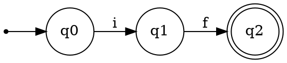
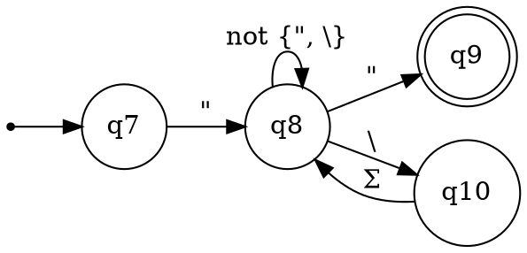
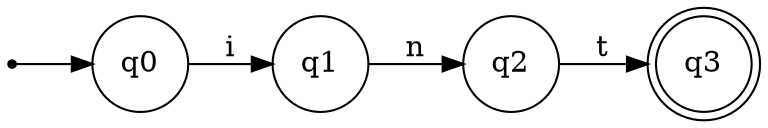
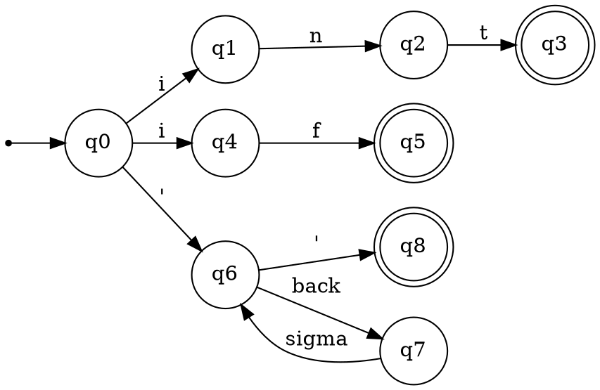
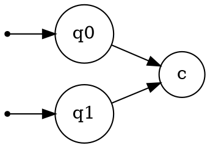
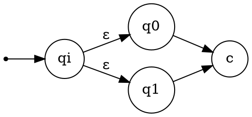

Prima di effettuare l'analisi, lo scanner deve effettuare delle operazioni preliminari:
- rimuovere i commenti
- **case conversion** per i linguaggi case-sensitive
- rimuovere gli spazi bianchi
- tracciare i numeri di linea, in modo da poter indicare dove si trova un errore
- output listing: creazione di una versione annotata del codice sorgente

Successivamente lo scanner può passare a leggere la sequenza di caratteri che costituisce il codice sorgente, raggruppandoli in lessemi

In un compilatore a più passate lo scanner interagisce continuamente con il parser, mandando i token non appena ne viene letto uno, e viceversa il parser richiederà il prossimo token allo scanner.

**Token** -> coppia costituita da nome del token e attributo (opzionale)
**Nome del token** -> rappresenta un tipo di unità lessicale o logica
**Lessema** -> specifica istanza di un token
**Pattern** -> descrizione compatta della forma che un lessema può assumere

L'attributo associato al token è necessario quando più lessemi possono essere associati allo stesso token
![[analisiLessicale.png|900]]
### Symbol table 
In genere usare una struttura dati statica non è opportuno, sia per questioni di tempo che di spazio. Per questo si usano le hash table che implementano le operazioni di ricerca e inserimento efficacemente.
- insert(s,t)
- lookup(s)

### Errori lessicali
Uno scanner ha una visione molto ridotta del codice sorgente, quindi è in grado di riconoscere pochi errori

in $FI(x<2)\{\dots$ non riconosce se è un errore di scrittura oppure esiste una funzione con quel nome

Lo scanner può procedere in diversi modi:
- segnala l'errore
- recupero dell'errore
	- ignora i caratteri finché non riconosce un token
	- trova il lessema più simile con il minimum distance

### Implementazione di uno scanner

- Linguaggio di basso livello - come assembly
- Linguaggio di alto livello
- Generatore automatico di analizzatori lessicali: si descrivono i pattern e il generatore fornisce una routine per la lettura dell'input (LEX, FLEX)

### Gestione dell'input
Uno scanner legge il codice sorgente un carattere alla volta, andando avanti. A volte però c'è bisogno di tornare indietro per essere sicuri che un lessema venga associato al token giusto (per es. <= e non solo =).
Per risolvere il problema e rendere tutto più efficiente si usano due tecniche: due puntatori per riconoscere i lessemi e il double buffering per non dovere caricare tutto il codice in memoria.

Due puntatori: *lexeme_beginning* e *forward*
1. codice caricato nel primo buffer ed entrambi i puntatori all'inizio
2. il puntatore forward va avanti finché non trova un match con un pattern
3. *lexeme_beginning* viene spostato alla fine del lessema trovato e si ricomincia
4. se il *forward* supera la lunghezza del primo buffer viene caricato il secondo. Se il *lexeme_beginning* arriva al secondo buffer, il primo viene sovrascritto con la concatenazione del codice, e così alternando fino alla fine.

### Descrizione dei token
Un modo efficiente per riconoscere e descrivere i pattern di un token sono le espressioni regolari
Un analizzatore lessicale che riconosce questi pattern è quindi un automa a stati finiti
#### Costruire l'automa per l'analizzatore lessicale
1. Determinare le regex che definiscono i token
2. Per ogni espressione costruire il DFA
3. Costruire l'NFA che riconosce tutti i token
4. Determinizzare l'automa
Es.
$E_{if}=if$ 


$E_{str}="((\Sigma\backslash\{"\backslash\})|\Sigma)*"$


$E_{int}=int$


Automa per tutti i token:



### Caratteristiche di un NFA

- Può avere più stati iniziali
- Può avere $\varepsilon$-transizioni
- $\delta$ può non essere univoca $(\delta(p, a)\in \{q_1,q_2\})$
Per il th. di Thomson c'è equivalenza tra regex e $\varepsilon$-NFA
#### Da espressione regolare a $\varepsilon$-NFA
![[[99] Archivio/Compilatori/imgs/regex1.png|900]]

Concatenazione:
![[[99] Archivio/Compilatori/imgs/regex2.png|900]]![[[99] Archivio/Compilatori/imgs/regex3.png|900]]

Unione:
![[[99] Archivio/Compilatori/imgs/regex4.png|900]]
![[[99] Archivio/Compilatori/imgs/regex5.png]]

Chiusura di Kleene:
![[[99] Archivio/Compilatori/imgs/regex6.png]]
![[regex7.png]]

### Da NFA a DFA
- Unificazione degli stati iniziali
- Chiusura transitiva delle $\varepsilon$-transizioni
- Retropropagazione delle letture sugli $\varepsilon$-archi
- Aggiornamento degli stati finali
- Rimozione di $\varepsilon$-transizioni e stati non più accessibili
- [[3. Subset Construction|Subset construcion]]

1. Unificare gli stati iniziali


2. Chiusura transitiva delle $\varepsilon$-transizioni
	```dot
	digraph G {
    rankdir=LR
    node [shape=circle]
    
    start [shape=point]
    
    start -> q0
    q0 -> q1 [label="ε"]
    q1 -> "..."  [label="ε"]
	"..."  -> qn [label="ε"]
	}
	```
	```dot
	digraph G {
    rankdir=LR
    node [shape=circle]
    
    start [shape=point]
    
    start -> q0
    q0 -> q1 [label="ε"]
    q1 -> "..."  [label="ε"]
	"..."  -> qn [label="ε"]
	q0 -> qn [label="ε"]
	}
	```
	si aggiunge una $\varepsilon$-transizione da $p$ a $q$ se esiste un cammino di $\varepsilon$-transizioni da $p$ a $q$
3. Retro-propagazione delle letture sugli $\varepsilon$-archi
	```dot
	digraph G {
    rankdir=LR
    node [shape=circle]
    
    p -> r [label="ε"]
    r -> q  [label="a"]
	}
	```
	```dot
	digraph G {
    rankdir=LR
    node [shape=circle]
    
    p -> r [label="ε"]
    r -> q  [label="a"]
    p -> q [label="a"]
	}
	```
4.  Aggiornamento degli stati finali
	```dot
	digraph G {
    rankdir=LR
    node [shape=circle]
    
    f [shape=doublecircle]
    
    q -> f [label="ε"]
	}
	```
	```dot
		digraph G {
	    rankdir=LR
	    node [shape=circle]
	    
	    f [shape=doublecircle]
	    q [shape=doublecircle]
	    
	    q -> f [label="ε"]
		}
	```
5. Rimozione delle $\varepsilon$-transizioni e stati non accessibili
6. Subset Construction

Esempio

![[nfa-dfa.png|500]]
- [ ] da finire

### Riconoscimento dei token
L'analizzatore lessicale deve individuare i lessemi verificando che rispettino i pattern indicati dai token. Operazione chiamata Pattern-Matching. Avere tutti i linguaggi disgiunti renderebbe tutto troppo complesso, quindi è inevitabile che si creino delle ambiguità. La soluzione è creare un ordine di priorità sui pattern con cui si ha avuto un match.
Si usa il Longest Best Match:
- Longest -> prendo il token con il più lungo match verificato
- Best -> in caso di parità di lunghezza, scelgo il pattern in base all'ordine di definizione o gerarchia
- [ ] esempio


